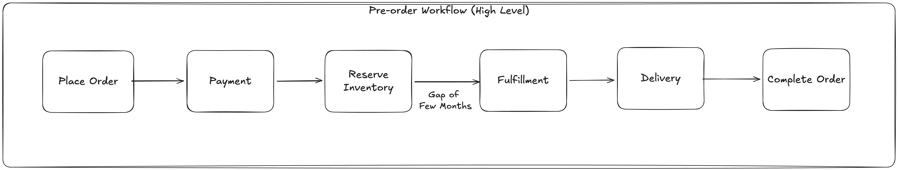
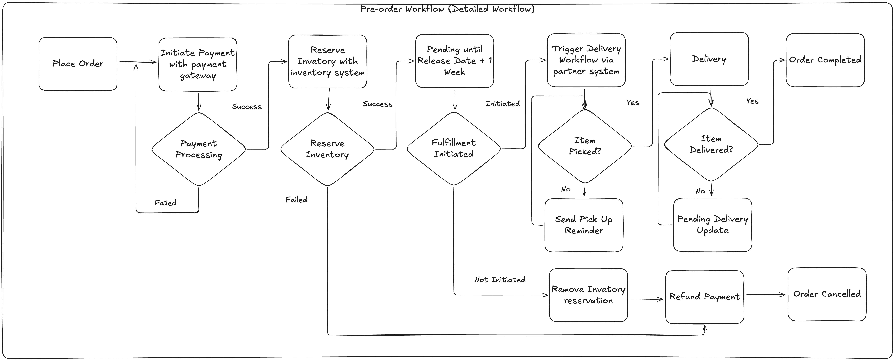

# Pre-Order System Demo

A demonstration of an e-commerce pre-order workflow system built with Temporal.

---

## Business Context

This application simulates a **pre-order system** for products with future release dates (e.g., new iPhone, gaming console, limited edition items).

### The Challenge

Pre-orders present unique challenges for e-commerce systems:
- Orders span **months** between placement and fulfillment
- Multiple systems must coordinate (payment, inventory, fulfillment, delivery)
- Failures at any stage require **automatic rollback** of all previous actions
- Human intervention is needed at key checkpoints (fulfillment, delivery confirmation)
- If customers don't complete the process by a deadline, the system must auto-cancel and refund

---

## High-Level Workflow



The pre-order process follows these stages:

| Stage | Description |
|-------|-------------|
| **Place Order** | Customer submits a pre-order for an upcoming product |
| **Payment** | Full payment is charged immediately via the payment gateway |
| **Reserve Inventory** | Inventory is reserved in the warehouse system |
| **Gap of Few Months** | System waits until the product release date |
| **Fulfillment** | Product is picked and handed to delivery partner |
| **Delivery** | Product is delivered to the customer |
| **Complete Order** | Order marked as completed |

---

## Detailed Workflow



### Phase 1: Payment Processing
- Initiates payment with the payment gateway
- Automatically retries on transient failures
- If payment fails completely, order is rejected

### Phase 2: Reserve Inventory
- Reserves inventory with the inventory system
- Automatically retries on transient failures
- If reservation fails, triggers refund and cancels order

### Phase 3: Pending Until Release Date + 1 Week
- System waits for the product release date plus a 1-week grace period
- During this time:
  - Fulfillment can be initiated to proceed
  - Order can be cancelled for a refund
- **Key Requirement:** If fulfillment is not initiated by the deadline, the order is automatically cancelled and refunded

### Phase 4: Trigger Delivery Workflow
- Creates a fulfillment order
- Triggers the delivery workflow via the partner system
- Waits for confirmation that item was picked up
- Sends periodic reminders if item is not picked up

### Phase 5: Delivery
- Waits for delivery confirmation
- Once confirmed, order is marked as **Completed**

### Compensation Flow (Automatic Rollback)
When cancellation or timeout occurs, the system automatically:
1. Releases the inventory reservation
2. Refunds the payment

This happens in **reverse order** of the original actions, ensuring data consistency across all integrated systems.

---

## System Requirements Summary

| Requirement | Description |
|-------------|-------------|
| **Long-running process** | Workflow spans months from pre-order to delivery |
| **Multi-system coordination** | Integrates with payment, inventory, fulfillment, and delivery systems |
| **Automatic retry** | Transient failures are automatically retried |
| **Automatic rollback** | Failures trigger compensation in reverse order |
| **Deadline enforcement** | Auto-cancel and refund if not fulfilled by release date + 1 week |
| **Human checkpoints** | Manual triggers for fulfillment initiation, pickup, and delivery |
| **Reminder notifications** | Periodic reminders when awaiting pickup |

---

## Setup and Demo

### Prerequisites

- Python 3.8+
- Temporal server running locally

### 1. Start Temporal Server

```bash
temporal server start-dev
```

This starts Temporal server at `localhost:7233` and the Web UI at `http://localhost:8233`.

### 2. Install Dependencies

```bash
python -m venv venv
source venv/bin/activate  # On Windows: venv\Scripts\activate
pip install temporalio
```

### 3. Start the Worker

```bash
python worker.py
```

### 4. Run the Demo

**Terminal 2: Place a pre-order**
```bash
python client.py place-order
```

This will output the workflow ID. Copy it for the next commands.

**Progress the workflow:**
```bash
# Start fulfillment (before timeout)
python client.py start-fulfillment <workflow_id>

# Confirm item was picked up
python client.py item-picked <workflow_id>

# Confirm delivery
python client.py confirm-delivery <workflow_id>
```

**Check status:**
```bash
python client.py status <workflow_id>
```

### 5. Test Automatic Rollback

```bash
# Place a new order
python client.py place-order

# Cancel it (triggers automatic refund)
python client.py cancel <workflow_id>
```

### 6. Test Timeout (Auto-Refund)

```bash
# Place an order
python client.py place-order

# Don't send any commands - wait for 1 week timeout
# The system will automatically cancel and refund
# (For demo, you can observe the durable timer state in Temporal UI)
```

---

## CLI Commands Reference

| Command | Description |
|---------|-------------|
| `python client.py place-order` | Place a new pre-order |
| `python client.py start-fulfillment <id>` | Initiate fulfillment |
| `python client.py cancel <id>` | Cancel order (triggers refund) |
| `python client.py item-picked <id>` | Confirm item pickup |
| `python client.py confirm-delivery <id>` | Confirm delivery complete |
| `python client.py status <id>` | Check order status |
| `python client.py compensation-log <id>` | View rollback actions |

---

## Temporal Web UI

View workflows at: **http://localhost:8233**
