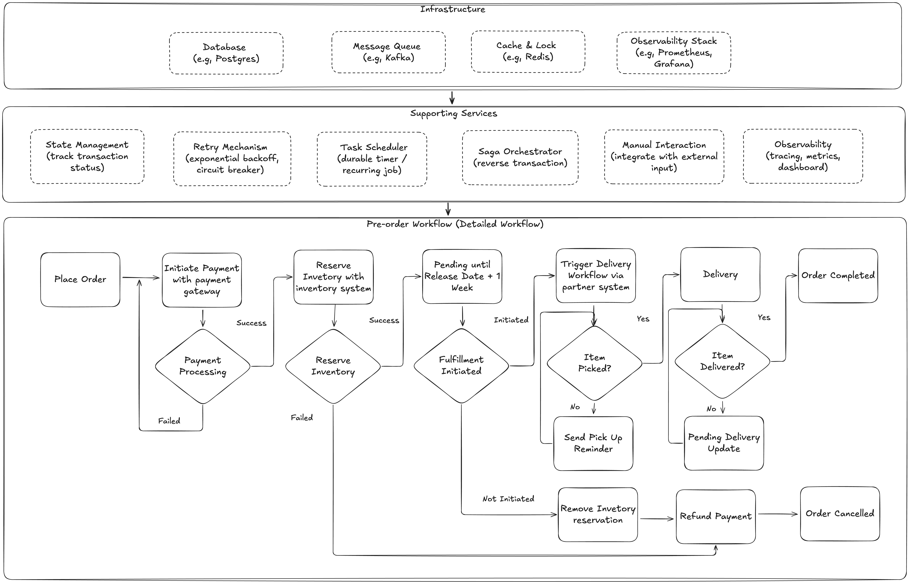
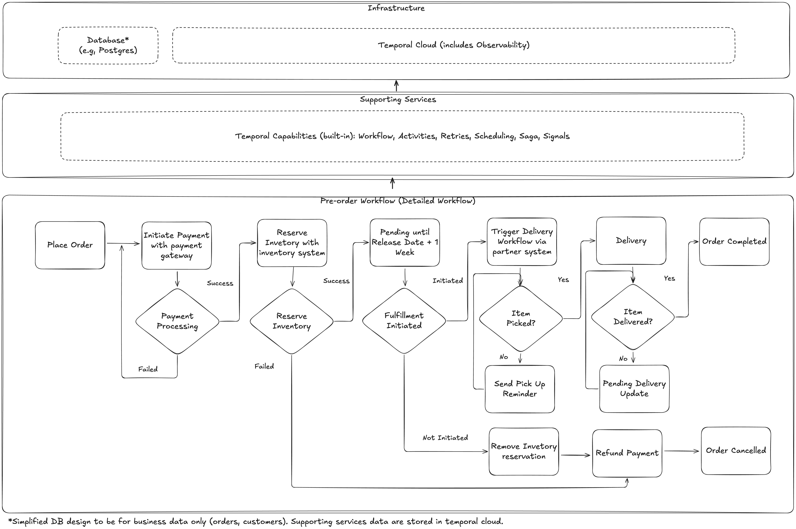

# Pre-Order System Demo 

A demonstration of an e-commerce pre-order workflow system built with Temporal.

---

## The Target Application

Website X is an e-commerce platform that focuses on providing pre-order services to businesses.

### The High Level Requirements

As part of the pre-orders system, there are various requirements on how the workflow or transactions is handled:

- Orders can span **months** between placement and fulfillment
- Multiple systems must coordinate (payment gateway, inventory, fulfillment, delivery)
- If suppliers don't fulfill the order by the stated fulfillment date, the system should cancel the order and refund
- As per the usual e-commerce workflow, human intervention is needed at key checkpoints (fulfillment, delivery confirmation)

---

## High-Level Workflow


The pre-order process follows these stages:

| Stage | Description |
|-------|-------------|
| **Place Order** | Customer submits a pre-order for an upcoming product |
| **Payment** | Full payment is charged immediately |
| **Reserve Inventory** | Inventory is reserved in the warehouse system |
| **Gap of Few Months** | System waits until the product release date |
| **Fulfillment** | Product is picked and handed to delivery partner |
| **Delivery** | Product is delivered to the customer |
| **Complete Order** | Order marked as completed |

---

## Detailed Workflow


### Phase 1: Payment Processing
- Initiates payment with the payment gateway
- Automatically retries on transient failures
- If payment fails completely, order is rejected

### Phase 2: Reserve Inventory
- Reserves inventory with the inventory system
- Automatically retries on transient failures
- If reservation fails, triggers refund and cancels order

### Phase 3: Pending Until Release Date + 1 Week
- System waits for the product release date plus a 1-week grace period
- During this time:
  - Fulfillment can be initiated to proceed
  - Order can be cancelled for a refund
- **Key Requirement:** If fulfillment is not initiated by the deadline, the order is automatically cancelled and refunded

### Phase 4: Trigger Delivery Workflow
- Creates a fulfillment order
- Triggers the delivery workflow via the partner system
- Waits for confirmation that item was picked up
- Sends periodic reminders if item is not picked up

### Phase 5: Delivery
- Waits for delivery confirmation
- Once confirmed, order is marked as **Completed**

### Compensation Flow (Automatic Rollback)
When cancellation or timeout occurs, the system automatically:
1. Releases the inventory reservation
2. Refunds the payment

This happens in **reverse order** of the original actions (Saga pattern), ensuring data consistency across all integrated systems.

---

## System Design: Before vs After Temporal

### Before Temporal: System Design for Scalability and Reliability



Building this system without Temporal requires significant infrastructure and custom development:

**Infrastructure Required (4 systems):**
- Database (e.g., PostgreSQL)
- Message Queue (e.g., Kafka)
- Cache & Lock (e.g., Redis)
- Observability (e.g., Prometheus, Grafana)

**Supporting Services to Build (6 services):**

| Service | Purpose |
|---------|---------|
| **State Management** | Track transaction status, checkpoints, crash recovery |
| **Retry Mechanism** | Exponential backoff, circuit breaker, idempotency |
| **Task Scheduler** | Durable timer, recurring jobs |
| **Saga Orchestrator** | Reverse transaction compensation |
| **Manual Interaction** | Integrate with external input, wait for callbacks |
| **Observability** | Tracing, metrics, dashboard instrumentation |

Each service requires careful design for enterprise-grade operation, reliability, and scalability. The infrastructure also requires consideration for high availability, scalability, and blast radius.

---

### After Temporal: Simplification



With Temporal, the architecture is dramatically simplified:

**Infrastructure Required (2 systems):**
- Database* (e.g., PostgreSQL) - for business data only
- Temporal Cloud (includes observability)

**Supporting Services to Build: 0**

All capabilities are provided natively by Temporal:
- Workflow orchestration
- Activities with automatic retry
- Durable scheduling/timers
- Saga compensation
- Signals for human interaction
- Built-in observability

*\*Simplified DB design for business data only (orders, customers). Supporting services data are stored in Temporal Cloud.*

---

### Key Values: Before → After Temporal

| Aspect | Before | After |
|--------|--------|-------|
| **Infrastructure** | 4 systems | 2 systems |
| **Supporting Services** | 6 to build | 0 (built-in) |
| **Business Logic** | Same | Same |
| **Observability** | Build yourself | Included |
| **Operations Overhead** | High | Low |

---

## Setup and Demo

### Prerequisites

- Python 3.8+
- Temporal server running locally

### 1. Start Temporal Server

```bash
temporal server start-dev
```

This starts Temporal server at `localhost:7233` and the Web UI at `http://localhost:8233`.

### 2. Install Dependencies

```bash
python -m venv venv
source venv/bin/activate  # On Windows: venv\Scripts\activate
pip install temporalio
```

### 3. Start the Worker

```bash
python worker.py
```

### 4. Run the Demo

**Terminal 2: Place a pre-order**
```bash
python client.py place-order
```

This will output the workflow ID. Copy it for the next commands.

**Progress the workflow:**
```bash
# Start fulfillment (before timeout)
python client.py start-fulfillment <workflow_id>

# Confirm item was picked up
python client.py item-picked <workflow_id>

# Confirm delivery
python client.py confirm-delivery <workflow_id>
```

**Check status:**
```bash
python client.py status <workflow_id>
```

### 5. Test Automatic Rollback

```bash
# Place a new order
python client.py place-order

# Cancel it (triggers automatic refund)
python client.py cancel <workflow_id>
```

---

## CLI Commands Reference

| Command | Description |
|---------|-------------|
| `python client.py place-order` | Place a new pre-order |
| `python client.py start-fulfillment <id>` | Initiate fulfillment |
| `python client.py cancel <id>` | Cancel order (triggers refund) |
| `python client.py item-picked <id>` | Confirm item pickup |
| `python client.py confirm-delivery <id>` | Confirm delivery complete |
| `python client.py status <id>` | Check order status |
| `python client.py deadline <id>` | Check deadline and remaining time |
| `python client.py compensation-log <id>` | View rollback actions |

---

## Temporal Web UI

View workflows at: **http://localhost:8233**
